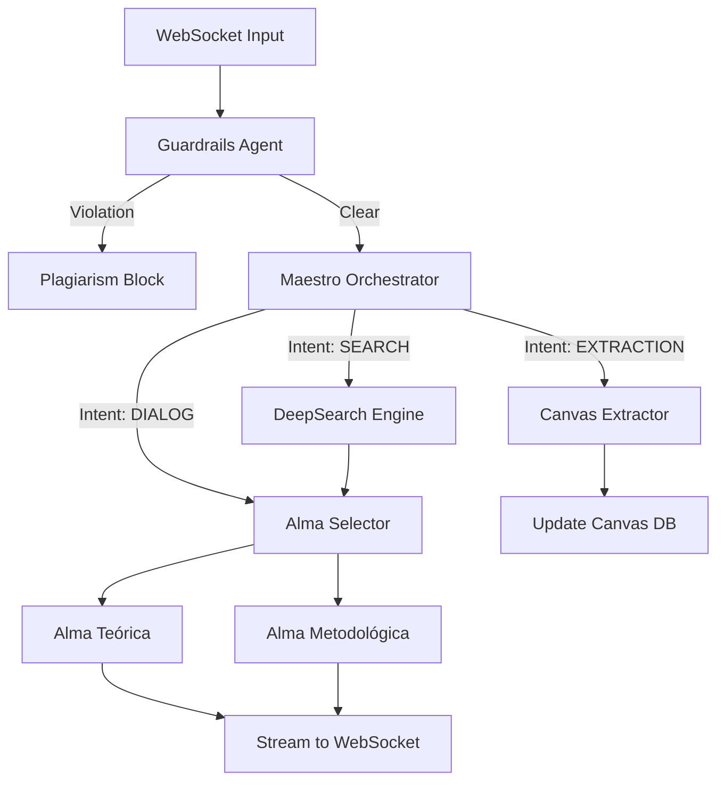
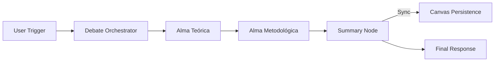

# Mapa da Arquitetura: Grafo e Estados

Este documento descreve a topologia do sistema de agentes e a estrutura de persistência de estado (GraphState) do Orientador.IA.

## 1. Topologia do Grafo de Decisão

O sistema opera em dois modos principais de orquestração, disparados via WebSocket no endpoint `/api/chat/{project_id}/ws`.

### A. Pipeline Standard (Orquestração Stateless)
Utilizado para diálogos diretos e tarefas de pesquisa.



### B. Pipeline de Debate (DebateOrchestrator)
Ativado por gatilhos de "desenvolvimento de canvas" ou palavras-chave de debate.



---

## 2. Estrutura do GraphState (Pydantic Model)

O `GraphState` é o objeto único de verdade que transita entre os nós. Ele é reconstruído a cada mensagem para garantir consistência stateless.

| Campo | Tipo | Descrição |
| :--- | :--- | :--- |
| `project_id` | `str` | Identificador único do projeto. |
| `user_id` | `str` | Identificador do usuário dono do projeto. |
| `academic_level` | `Enum` | Nível (BACHELORS, MASTERS, PHD, etc). |
| `chat_history` | `List[Message]` | Histórico recente das últimas 50 mensagens. |
| `current_canvas` | `CanvasState` | Estado atual de todos os campos do Canvas (Tema, Problema, etc). |
| `active_theoretical_alma` | `str` | Nome da Alma Teórica selecionada para o projeto. |
| `active_methodological_alma`| `str` | Nome da Alma Metodológica selecionada. |
| `orchestrator_directive` | `str` | Instrução interna do Maestro para a Alma ativa. |
| `empirical_documents` | `List[Any]` | Metadados de arquivos anexados (PDF/DOCX). |
| `validation_flags` | `Model` | Flags de plágio e necessidade de bibliografia. |

### Detalhe do CanvasState
Cada campo do canvas (Tema, Problema, Justificativa) segue o padrão:
```python
{
    "content": str,
    "is_locked": bool
}
```

---

## 3. Comportamento dos Nós (Agents)

1.  **Maestro (Orquestrador)**: Analisa a intenção (`SEARCH`, `DIALOG`, `EXTRACTION`) e delega para a Alma correta.
2.  **Almas (Teórica / Metodológica)**: Especialistas em conteúdo que geram as respostas finais.
3.  **Extractor**: Nó especializado em converter diálogo em atualizações estruturadas para o banco de dados SQL.
4.  **DeepSearch**: Integração com ferramentas de busca para fundamentação bibliográfica.

---
> [!NOTE]
> Esta arquitetura foi projetada para ser tolerante a falhas (Stateless) e auditável através do histórico de mensagens e transições de estado no banco de dados.
