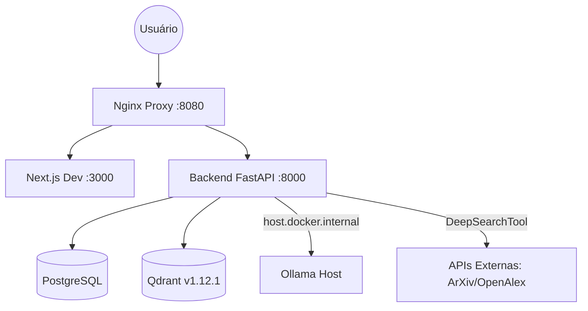

# Orientador.IA: Documentação Técnica Centralizada (v9.2.1)

> [!TIP]
> Para detalhes de manutenção e anti-padrões, consulte o [GUIA_MANUTENCAO.md](./GUIA_MANUTENCAO.md) e o [MAPA_SISTEMA.md](../docs/results/MAPA_SISTEMA.md).

## 1. Infraestrutura Core
| Serviço | Versão | Porta | Contexto/Limite |
| :--- | :--- | :--- | :--- |
| **Backend** | Python 3.12 (FastAPI) | 8000 | num_ctx: 16,384 |
| **Frontend** | Next.js 15 | 3000 | bypass: 100MB |
| **Qdrant** | v1.12.1 | 6333 | Universal Query API |
| **Ollama** | Host (Windows) | 11434 | Instância externa |

---

## 2. Topologia do Sistema

---

## 3. Mecanismos de Resiliência

### 3.1 Gênesis v9.2.0 (Resiliência JSON)
O `GenesisService` utiliza um motor de extração robusto para garantir a criação de Almas em modelos de pequena escala:
- **Extração Key-Stack**: Substituiu Regex recursiva por contador de chaves `{}` para isolar o JSON de preâmbulos.
- **Retry (3x)**: Loop de tentativa com `astream_events` e log de diagnóstico da resposta bruta (`final_raw_response`).
- **Contexto**: Travado em **16,384 tokens** para suportar prompts autoriais densos.

### 3.2 Document Processing & RAG
- **Busca Híbrida**: Densa (`nomic-embed`) + Esparsa (SPLADE-style hashing).
- **Universal Query API**: Transição de `search` para `query_points` (compatibilidade qdrant-client 1.17+).

---

## 4. Orquestração de Debate (Ateliê Socrático v9)
O sistema de debate opera via **Grafo de Estados (LangGraph)**:
- **`DebateSubGraph`**: Gerencia o fluxo circular entre Almas (Primária, Complementar, Antagonista, Metodológica).
- **`DebateRunner.py`**: Nó de execução que injeta o `DEBATE_CORE_RULES` (v3) e orquestra os turnos.
- **`alma_registry.py`**: Resolve identidades reais (nomes/cores) do `panel`, eliminando nomes genéricos.
- **Streaming**: Streaming de chunks rotulados (`debate_chunk`) via WebSocket em `chat.py`.

---

## 5. Gestão de Documentação e Artefatos
Para redução de entropia, o repositório segue a topologia:
- **`/docs/artifacts/`**: Documentos PDF e insumos.
- **`/docs/results/`**: Relatórios, `findings.md`, `progress.md` e `MAPA_SISTEMA.md`.
- **`/docs/ui/`**: Protótipos HTML e experimentos visuais.
- **`STATUS.md`**: Âncora de sincronização (Root).

---

## 6. Administração e Observabilidade
- **Check-db**: Auditoria de integridade SQL em `check_db.py`.
- **Diagnose**: Check-up total (RAG/DB/LLM) em `diagnose_system.py`.
- **Performance**: Monitoramento de latência em `SystemMetric` (limite visual de 40s).

---
### Histórico de Mudanças Críticas
- **v9.2.1**: Unificação documental. Correção de referências para `DebateSubGraph` e fluxos de extração robusta.
- **v9.2.0**: Implementação de `num_ctx=16384` e Resiliência no Gênesis (Retry + Stack-Based Parsing).
- **v9.1.5**: Migração Qdrant para `query_points`. Organização de diretórios em `/docs`.

*Documentação Técnica - Protocolo DocumentationSphinx - 05/04/2026*
` (OpenAlex/SciELO). Suíte de testes `test_search_audit.py` validou integridade de reconstrução de abstracts (Inverted Index) e resiliência a timeouts.
