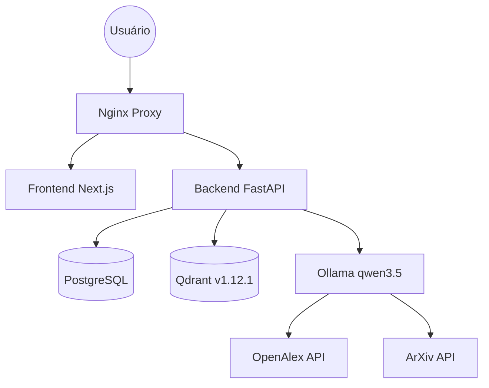

# Orientador.IA: Documentação Técnica Centralizada

## 1. Infraestrutura Core
| Serviço | Versão | Porta | Contexto/Limite |
| :--- | :--- | :--- | :--- |
| **Backend** | Python 3.12 (FastAPI) | 8000 | - |
| **Frontend** | Next.js 15 | 3000 | - |
| **Qdrant** | v1.12.1 | 6333 | Busca Vetorial Real-time |
| **Ollama** | latest | 11434 | 8,192 tokens (num_ctx) |
| **PostgreSQL** | v16 | 5432 | Persistent Storage |
| **Nginx** | latest | 80/443 | Reverse Proxy |

---

## 2. Topologia do Sistema


---

## 3. Mecanismos de Resiliência
### 3.1 ADK Regex Shim
O sistema utiliza um wrapper customizável (`adk.py`) para extração de JSON. 
- **Problema**: Modelos pequenos (0.8b) costumam incluir preâmbulos conversacionais.
- **Solução**: Extração baseada em Regex para capturar estritamente o conteúdo entre `{}`.

### 3.2 Document Processing
- **Robust Chunking**: Limite manual de 2000 caracteres por chunk antes do embedding para evitar estouro de contexto no Ollama/BERT.

---

## 4. Orquestração de Pesquisa (Search Engine)
O `DeepSearchTool` realiza buscas concorrentes em múltiplas fontes acadêmicas:
1.  **ArXiv**: Busca direta via API XML.
2.  **OpenAlex**: Fonte primária para papers multidisciplinares.
3.  **SciELO (via OpenAlex)**: Acesso via filtros de `source` do OpenAlex para garantir estabilidade (evita bloqueios 403 e 404 da API nativa).

---

## 5. Debate Runner (Ateliê Socrático)
O sistema de debate foi refatorado para um modelo estritamente sequencial e reativo:
- **Fluxo**: Proposição (Primária) -> Complementação (Complementar) -> Antagonismo (Antagonista).
- **Streaming**: Implementado `Agent.stream` no `adk.py` para visualização granular no frontend.
- **Contexto**: Injeção automática das transcrições dos turnos anteriores no prompt do participante atual.

---

## 5. Administração e Observabilidade
### 5.1 Promoção de Admin
```sql
UPDATE users SET is_admin = True WHERE email = 'admin@exemplo.com';
```

### 5.2 Monitoramento de Performance
- Tabela `system_metrics` registra latência e status HTTP.
- Alerta visual no dashboard para requisições superiores a **40 segundos**.

---
---

## 6. Resultados da Auditoria de Performance (Stress Test)
Realizada em 2026-03-11 para validar a robustez do novo `DebateRunner`:
- **Crescimento de Contexto**: Validado crescimento linear (Turno 1: ~22 chars -> Turno 3: ~350 chars). Injeção de transcrição confirmada.
- **Integridade de Contexto**: Verificada ausência de truncagem dentro do limite de 8,192 tokens.
- **Latência (Pipeline Overhead)**: < 0.1s para orquestração interna (excluindo tempo de geração da LLM).
- **TTFT (Time to First Chunk)**: Otimizado via `Agent.stream` para visualização instantânea.

---
### Histórico de Modificações (Audit Log)
- 11/03/2026: Refactoring `DebateRunner` para lógica estritamente sequencial, implementação de `Agent.stream`, ajuste de `num_ctx=8192` no Ollama e correção de proxy no `next.config.ts`.
- 11/03/2026: Adicionado `suppressHydrationWarning` ao `layout.tsx` para evitar erros de mismatch causados por atributos injetados em ambiente de teste/automação.

*Documentação Técnica - Protocolo DocumentationSphinx*
