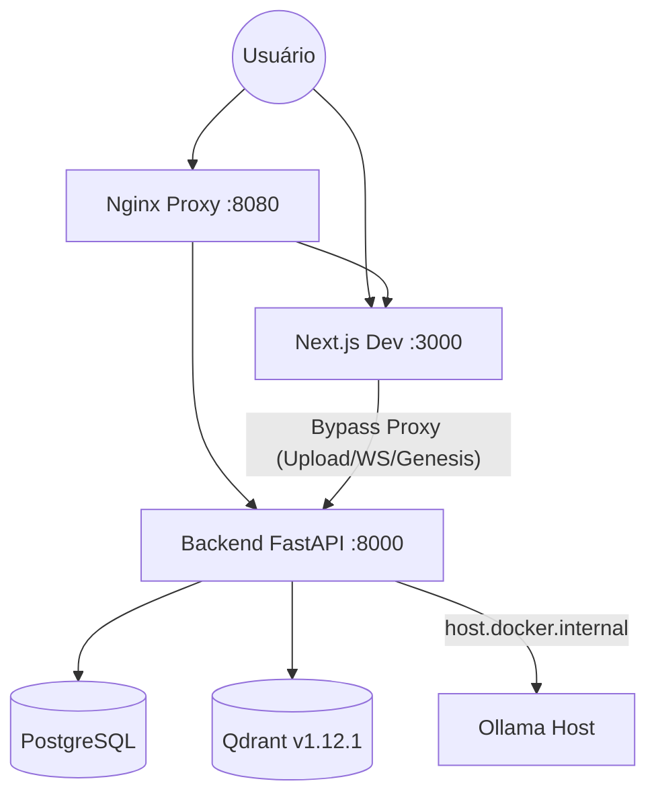

# Orientador.IA: Documentação Técnica Centralizada

> [!TIP]
> Para detalhes de manutenção, dependências e anti-padrões, consulte o [GUIA_MANUTENCAO.md](./GUIA_MANUTENCAO.md).

## 1. Infraestrutura Core
| Serviço | Versão | Porta | Contexto/Limite |
| :--- | :--- | :--- | :--- |
| **Backend** | Python 3.12 (FastAPI) | 8000 | - |
| **Frontend** | Next.js 15 | 3000 | - |
| **Qdrant** | v1.12.1 | 6333 | Busca Vetorial Real-time |
| **Ollama** | Host (Windows) | 11434 | Instância externa para GPU Access |
| **PostgreSQL** | v16 | 5432 | Persistent Storage |
| **Nginx** | latest | 8080 (Host) | Reverse Proxy (100MB limit) |

---

## 2. Topologia do Sistema


---

## 3. Mecanismos de Resiliência
3.1 ADK Regex Shim
O sistema utiliza um wrapper customizável (`adk.py`) para extração de JSON. 
- **Problema**: Modelos pequenos (0.8b) costumam incluir preâmbulos conversacionais.
- **Solução**: Extração baseada em Regex para capturar estritamente o conteúdo entre `{}`.

### 3.2 Document Processing & Upload
- **Robust Chunking**: Limite manual de 2000 caracteres por chunk antes do embedding para evitar estouro de contexto no Ollama/BERT.
- **Proxy Bypass (Gargalo C Fix)**: O frontend detecta requisições de upload, WebSocket ou rotas lentas (Genesis) e as direciona diretamente para o backend na porta 8000. Isso evita os limites default de 10MB do `Next.js development proxy` e falhas de `protocol upgrade` em WebSockets via rewrites do Next.js.

---

## 4. Orquestração de Pesquisa (Search Engine)
O `DeepSearchTool` realiza buscas concorrentes em múltiplas fontes acadêmicas:
1.  **ArXiv**: Busca direta via API XML.
2.  **OpenAlex**: Fonte primária para papers multidisciplinares.
3.  **SciELO (via OpenAlex)**: Acesso via filtros de `source` do OpenAlex para garantir estabilidade (evita bloqueios 403 e 404 da API nativa).

---

### 5. Debate Runner (Ateliê Socrático)
O sistema de debate opera em um modelo estritamente sequencial e reativo:
- **Fluxo**: Proposição (Primária) -> Complementação (Complementar) -> Antagonismo (Antagonista).
- **Streaming**: Implementado `Agent.stream` no `adk.py` para visualização granular no frontend.
- **Identidade Dinâmica (v9.1.0)**: O sistema resolve nomes e cores em tempo real via metadados do `panel`. Placeholder genéricos ("Alma Primária") foram eliminados em favor de nomes reais (ex: Foucault).
- **Gênesis de Emergência (Rigor 80%)**: Em `graph_factory.py`, se a aderência semântica de uma Alma for inferior a 0.8, o sistema dispara o `GenesisService` para criar um especialista *ad hoc* perfeitamente alinhado ao tema.
- **Persistência de Especialistas**: Almas geradas via emergência são persistidas em `ecosystem_resources` (`is_approved=True`), permitindo que o catálogo teórico do sistema se expanda organicamente com o uso.


---

## 5. Administração e Observabilidade
### 5.1 Promoção de Admin
```sql
UPDATE users SET is_admin = True WHERE email = 'admin@exemplo.com';
```

### 5.2 Monitoramento de Performance
- Tabela `system_metrics` registra latência e status HTTP.
- Alerta visual no dashboard para requisições superiores a **40 segundos**.

---
---

## 6. Resultados da Auditoria de Performance (Stress Test)
Realizada em 2026-03-11 para validar a robustez do novo `DebateRunner`:
- **Crescimento de Contexto**: Validado crescimento linear (Turno 1: ~22 chars -> Turno 3: ~350 chars). Injeção de transcrição confirmada.
- **Integridade de Contexto**: Verificada ausência de truncagem dentro do limite de 8,192 tokens.
- **Latência (Pipeline Overhead)**: < 0.1s para orquestração interna (excluindo tempo de geração da LLM).
- **TTFT (Time to First Chunk)**: Otimizado via `Agent.stream` para visualização instantânea.

---
### Histórico de Modificações (Audit Log)
- 11/03/2026: Refactoring `DebateRunner` para lógica estritamente sequencial, implementação de `Agent.stream`, ajuste de `num_ctx=8192` no Ollama e correção de proxy no `next.config.ts`.
- 11/03/2026: Adicionado `suppressHydrationWarning` ao `layout.tsx` para evitar erros de mismatch causados por atributos injetados em ambiente de teste/automação.
- 25/03/2026: Remoção do serviço Ollama do Docker para uso exclusivo da instância do Host. Correção de `OLLAMA_BASE_URL` para `host.docker.internal`. Implementação de bypass de proxy no frontend (`api.ts` e `ws.ts`) para suportar uploads superiores a 10MB e estabilidade de WebSocket.
- 25/03/2026: Correção Crítica de Whiteboard Drawing (NTC). Consolidado `update_whiteboard` como ferramenta nativa. Corrigida falha no streaming de `BaseAlma.stream_response` que interceptava chunks de ferramentas sem os retransmitir. Implementada injeção de resposta de ferramenta no contexto local da Alma para garantir continuidade do diálogo após o desenho no quadro. Alinhado script de teste `test_llm_tool_calling.py` com os nomes de produção.

- 26/03/2026: Migração do `tldraw` para `richText` (API v4.5.3). Corrigido erro de validação ao criar nós e setas no canvas. Implementada utilidade `toRichText` no frontend para conversão automática de strings. Alinhadas propriedades dos shapes para usar `textAlign` em vez de `align`.
- 01/04/2026 (v9.1.0): Universalização da Identidade e Persistência do Gênesis. Refatoração do `debate_node` para suporte a **Aderência Crítica (< 80%)** com fallback para Gênesis automático. Implementada persistência de Almas de emergência no PostgreSQL. Sincronização de metadados entre `chat.py` e `alma_registry.py` para eliminação de nomes genéricos no frontend. Adicionada injeção de `custom_instructions` (léxico e personalidade) nos prompts das Almas do debate.

*Documentação Técnica - Protocolo DocumentationSphinx*

