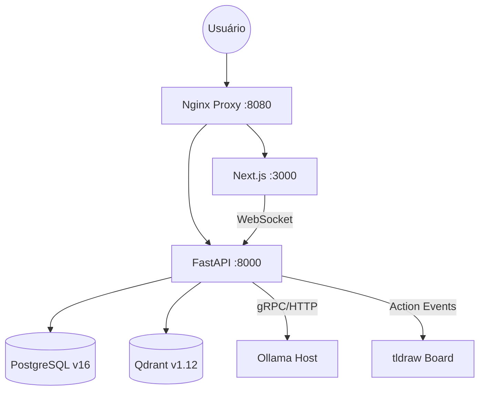

# Orientador.IA: Ecossistema de Orientação Acadêmica (v8.0)

Plataforma de alta densidade para suporte à pesquisa, escrita e estruturação acadêmica via orquestração multi-agente.

---

## 🏗️ Arquitetura Core (v8)

| Componente | Tecnologia | Versão/Status |
| :--- | :--- | :--- |
| **Backend** | FastAPI / Python 3.12 | Operacional (Async/WebSocket) |
| **Frontend** | Next.js 15 (App Router) | React + tldraw v4.5.3 |
| **Vetor DB** | Qdrant | v1.12.1 (Situational Ingestion) |
| **Embeddings** | `nomic-embed-text` | 768d Multilingual |
| **Engine RAG** | Hybrid Search (Dense + Sparse) | SPLADE-style term mapping |
| **Orquestrador** | LangGraph (Stateful Graphs) | v8.0.0 (Non-linear Debate) |

### 🧭 Topologia do Sistema


---

## 🚀 Funcionalidades Chave

### 1. RAG Situacional v2.1.0
O sistema utiliza **Ingestão Contextual** via `pymupdf4llm`:
- **Preservação Semântica**: Extração de tabelas, imagens e fórmulas LaTeX em Markdown.
- **Frases Situacionais**: Cada fragmento (~300 palavras) recebe um resumo contextual (`qwen3.5:0.8b`) antes da vetorização.
- **Busca Híbrida**: Combinação de similaridade semântica (Densa) com hashing determinístico para termos técnicos (Esparsa).

### 2. Debate Mode v8 (Multi-Agente)
Orquestração via **LangGraph** que automatiza a dialética acadêmica:
- **Papéis Dinâmicos**: Primária (Tese), Complementar (Síntese) e Antagonista (Antítese).
- **Situational Grounding**: O estado atual do whiteboard (tldraw) é injetado como contexto nos prompts das Almas.
- **WebSocket Contract**: Validação rigorosa via **Zod** no frontend para evitar falhas de renderização de turnos.

### 3. Soul-Canvas (Whiteboard Ativo)
Os agentes interagem diretamente com o quadro branco:
- Chamada de ferramentas para criação de nós, setas e agrupamentos.
- Renderização em tempo real via **`toRichText`** (protocolo tldraw v4.5.3).

---

## 🛠️ Como Iniciar

1. Certifique-se que o Docker e a instância Host do Ollama estão ativos.
2. Execute o orquestrador de inicialização:
```powershell
./start_orientador.bat
```
O script cuidará das migrações do banco, download dos modelos e inicialização dos serviços em rede interna.

---

## 📎 Documentação Complementar
- [Documentação Técnica (Core)](./DOCUMENTACAO_TECNICA.md)
- [Guia de Manutenção e Débito](./GUIA_MANUTENCAO.md)
- [Ciclo de Vida de Almas](./docs/ALMA_LIFECYCLE_INTEGRITY_v1.md)

*v8.0.0 — Protocolo DocumentationSphinx. Sincronizado: 2026-03-31.*

