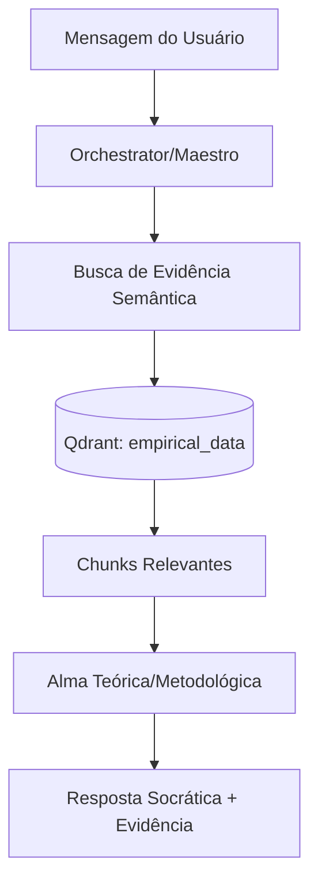

# Carregamento de Documentos e Arquitetura RAG

## 1. Visão Geral
O Orientador.IA processa dados empíricos (PDF, CSV) através de um pipeline automatizado para indexação e Geração Aumentada por Recuperação (RAG). Isso permite que as "Almas" fundamentem suas orientações acadêmicas em evidências reais carregadas pelo usuário.

## 2. Workflow de Ingestão
| Etapa | Descrição | Componente/Ferramenta |
| :--- | :--- | :--- |
| **Endpoint API** | `POST /api/empirical/{project_id}/upload` | FastAPI |
| **Extração** | PDF -> Texto via `fitz` (PyMuPDF). CSV -> Texto via Pandas. | `EmpiricalProcessor` |
| **Chunking** | Split recursivo por caracteres (800 chars, 100 overlap). | `_chunk_text()` |
| **Embedding** | `nomic-embed-text` | Ollama (768d) |
| **Indexação** | Upsert de pontos com Payload `project_id`. | Qdrant |

## 3. Embeddings & Vector DB
- **Modelo**: `nomic-embed-text` via Ollama.
- **Dimensões**: 768.
- **Métrica de Distância**: Similaridade de Cosseno.
- **Coleções (Qdrant)**:
    - `empirical_data`: Documentos carregados para RAG (isolados por `project_id`).
    - `almas_catalog`: Catálogo de Almas disponíveis para matching semântico.

## 4. Implementação RAG e Fluxo Contextual
A recuperação é estritamente filtrada pelo `project_id` para garantir o isolamento de dados entre projetos.

## 5. Estratégia de Persistência
- **SQL (PostgreSQL)**: Authority para metadados estruturados (Usuários, Projetos, Estado do Canvas, Almas Customizadas).
- **Vector (Qdrant)**: Engine de busca semântica para fragmentos de documentos e matching de personalidades (Almas).
- **Integridade**: O `project_id` (UUID) atua como a chave de partição lógica em ambos os bancos.

## 6. Indexação de Seções de PDF (Detalhe Técnico)
Além dos chunks semânticos, o `PDFSectionIndex` (`pdf_section_indexer.py`) realiza uma análise estrutural do documento:

### 6.1 Detecção de Estrutura
O indexador utiliza expressões regulares (`re.compile(r'§\s*(\d+(?:\.\d+)*)')`) para identificar marcadores de seção e cabeçalhos numéricos.
- **Entrada**: Arquivo PDF físico.
- **Processamento**: Varredura de blocos de texto buscando padrões como `§2.3`, `1. Introdução`, etc.
- **Mapeamento**: Cada referência é mapeada para um objeto `SectionLocation`:
    * `page`: Índice da página (0-indexed).
    * `y_top` / `y_bottom`: Coordenadas Y normalizadas (0-1) para renderização no frontend.
    * `text_snippet`: Amostra inicial da seção para validação.

### 6.2 Integração com Frontend
Estes metadados permitem a funcionalidade de **Spotlight Overlay**: quando uma Alma cita uma seção específica (ex: "Conforme §4.2"), o frontend utiliza `locate(section_ref)` para destacar visualmente a área exata no PDF, melhorando a rastreabilidade da evidência.

### 6.3 Fallback de Busca
Caso a referência exata não seja encontrada, o sistema executa `search_keyword()` como fallback, escaneando o conteúdo textual bruto para aproximar a localização da informação relevante.
